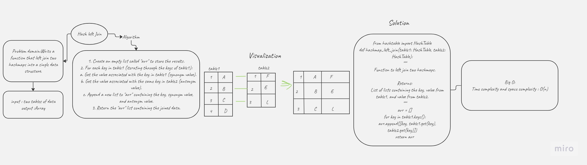

# Hash_Left_Join

## wHITE BOARD:


## Approach and effiency:
1. Create an empty list called "arr" to store the results.
2. For each key in table1 (iterating through the keys of table1):
   a. Get the value associated with the key in table1 (synonym value).
   b. Get the value associated with the same key in table2 (antonym value).
   c. Append a new list to "arr" containing the key, synonym value, and antonym value.
3. Return the "arr" list containing the joined data.

## Solution :
```
from hashtable import HashTable

def hashmap_left_join(table1: HashTable, table2: HashTable):
    """
    Function to left join two hashmaps.

    Returns:
        List of lists containing the key, value from table1, and value from table2.
    """
    arr = []
    for key in table1.keys():
        arr.append([key, table1.get(key), table2.get(key)])
    return arr
```