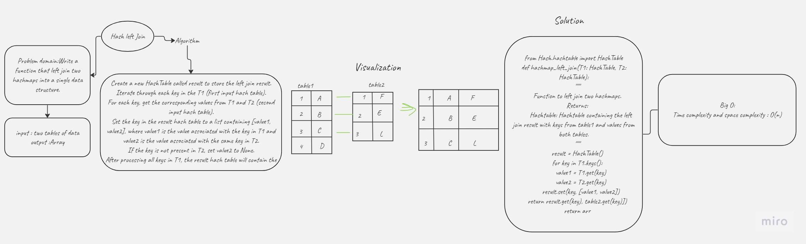

# Hash_Left_Join

## wHITE BOARD:


## Approach and effiency:
Create a new HashTable called result to store the left join result.
Iterate through each key in the T1 (first input hash table).
For each key, get the corresponding values from T1 and T2 (second input hash table).
Set the key in the result hash table to a list containing [value1, value2], where value1 is the value associated with the key in T1 and value2 is the value associated with the same key in T2.
If the key is not present in T2, set value2 to None.
After processing all keys in T1, the result hash table will contain the left join result.
Return the result hash table.

## Solution :
```
from Hash.hashtable import HashTable
def hashmap_left_join(T1: HashTable, T2: HashTable):
    """
    Function to left join two hashmaps.

    Returns:
        Hashtable: Hashtable containing the left join result with keys from table1 and values from both tables.
    """
    result = HashTable()
    for key in T1.keys():
        value1 = T1.get(key)
        value2 = T2.get(key)
        result.set(key, [value1, value2])
    return result
```