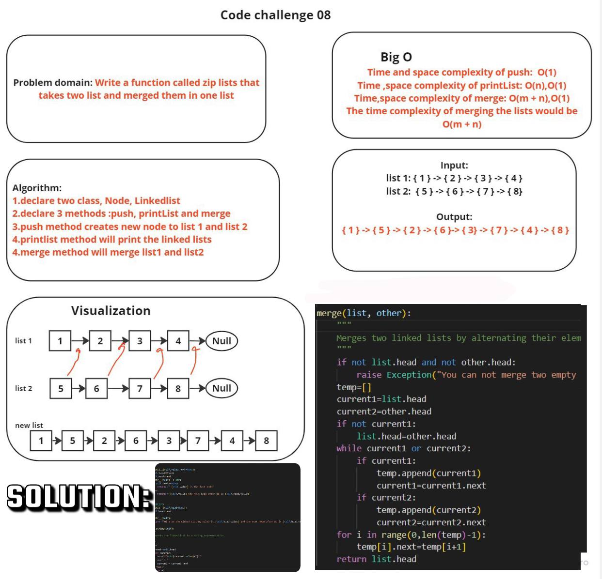

# code challange 8
## White Board :

## Approach and effeincy :
```
This code allow to merge two linked list in one list
```
## Solution

```

class Node:
    def __init__(self,value,next=None):
        self.value=value
        self.next=next
    def __str__(self) -> str:
        if self.next==None:
            return f" {self.value} is the last node"
        else:
            return f"{self.value} the next node after me is {self.next.value}"
        

class LinkedList:
    def __init__(self,head=None):
        self.head=head

    def __str__(self):
        return f"Hi I am the Linked List my value is {self.head.value} and the next node after me is {self.head.next.value}"
            
    def to_string(self):
        """
        Converts the linked list to a string representation.

        """
        a=""
        current=self.head
        while current:
            a=a+"{"+str(current.value)+"} "
            a+="-> "
            current = current.next
        a+="Null"
        return a
def merge(list, other):
        """
        Merges two linked lists by alternating their elements.
        """
        if not list.head and not other.head:
            raise Exception("You can not merge two empty lists")
        temp=[]
        current1=list.head
        current2=other.head
        if not current1:
            list.head=other.head
        while current1 or current2:
            if current1:
                temp.append(current1)
                current1=current1.next
            if current2:
                temp.append(current2)
                current2=current2.next
        for i in range(0,len(temp)-1):
            temp[i].next=temp[i+1]
        return list.head

```