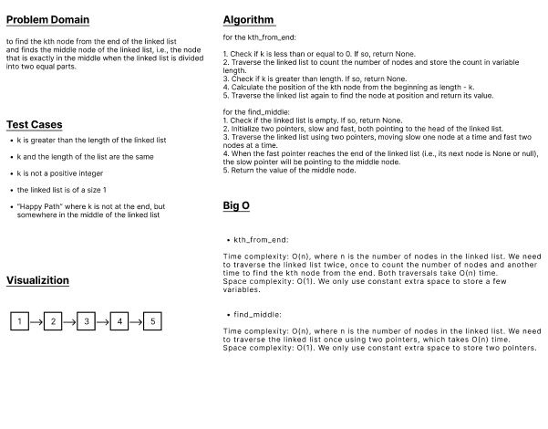

# White board

# Approach & Efficiency
```
I created a method for delete in Linked list class, Also method that gets the length of the linked list
```
# Solution
```
def delete(self, value):
        current_node = self.head
        if current_node and current_node.value == value:
            self.head = current_node.next
            current_node = None
            return

        previous_node = None
        while current_node and current_node.value != value:
            previous_node = current_node
            current_node = current_node.next

        if current_node is None:
            return

        previous_node.next = current_node.next
        current_node = None


    def kth_from_end(self, k):
        if k <= 0:
            return None

        # Get the length of the linked list
        length = 0
        current = self.head
        while current:
            length += 1
            current = current.next

        if k > length:
            return None
```