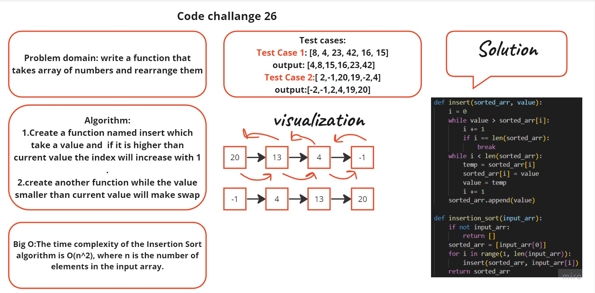

# Tracing a Pseudocode
## White board:


## Approach and effiency
Insert and insertion_sort are the two methods that make up the Sort class definition. The class is in charge of inserting a sort on a list.A value and a sorted list are the inputs for the insert method. It locates the value's proper location in the sorted list so that the order of the list is preserved. While iterating backwards through the list, the procedure compares the value with each entry using a while loop. The element is moved one position to the right if the value is smaller than the one in the current position. The value is entered into the list using the insert method of the list object after the right position has been identified.


## Pseudocode
```
Insert(int[] sorted, int value)
  initialize i to 0
  WHILE value > sorted[i]
    set i to i + 1
  WHILE i < sorted.length
    set temp to sorted[i]
    set sorted[i] to value
    set value to temp
    set i to i + 1
  append value to sorted

InsertionSort(int[] input)
  LET sorted = New Empty Array
  sorted[0] = input[0]
  FOR i from 1 up to input.length
    Insert(sorted, input[i])
  return sorted
```
## code using python:
```
def insert(sorted_arr, value):
    i = 0
    while value > sorted_arr[i]:
        i += 1
        if i == len(sorted_arr):
            break
    while i < len(sorted_arr):
        temp = sorted_arr[i]
        sorted_arr[i] = value
        value = temp
        i += 1
    sorted_arr.append(value)

def insertion_sort(input_arr):
    if not input_arr:
        return []
    sorted_arr = [input_arr[0]]
    for i in range(1, len(input_arr)):
        insert(sorted_arr, input_arr[i])
    return sorted_arr
```
