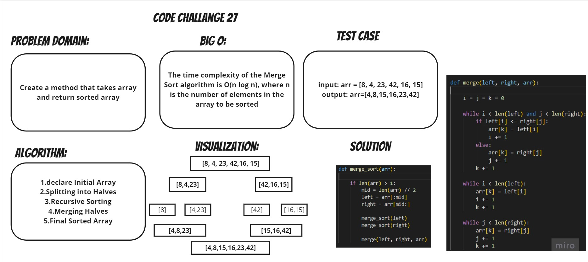

# merging sort
## Understanding Merge Sort
```
Merge Sort is one of the most efficient and popular sorting algorithms used to sort arrays or lists. It follows the divide-and-conquer approach, breaking down the input into smaller subproblems, solving them recursively, and then merging the solutions to obtain the final sorted result. In this article, we will explore the step-by-step process of Merge Sort using a visual representation, and then implement the algorithm in code.

```
```
Merge Sort is an efficient algorithm for sorting arrays or lists. By dividing the input into smaller subproblems, sorting them recursively, and merging the sorted solutions, Merge Sort achieves a time complexity of O(n log n). In this article, we visualized the step-by-step process of Merge Sort and implemented the algorithm in Python. By testing our implementation, we can ensure that it sorts arrays correctly. Merge Sort is a powerful tool in the field of algorithms and a fundamental concept in computer science.
```
## Approach and effiency:
1.Initial Array

2.Splitting into Halves 

3.Recursive Sorting

4.Merging Halves

5.Final Sorted Array
 ## white board:

