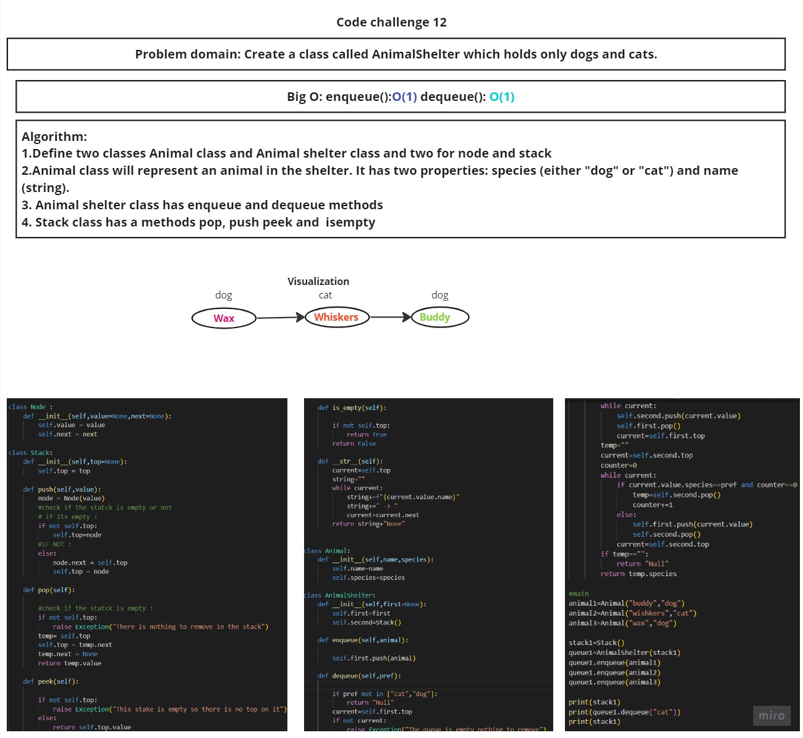

# White Board

# Approach and effiency
```
I used two class one to represetn the animal in shelter and other contain methods enqueue and dequeue. also i used  two queue one for cat and one for dog
```
# Solution
```
class Animal:
    def __init__(self, species, name):
        self.species = species
        self.name = name

class AnimalShelter:
    def __init__(self):
        self.animal_queue = []

    def enqueue(self, animal):
        self.animal_queue.append(animal)

    def dequeue(self, pref):
        if pref == "dog":
            for i, animal in enumerate(self.animal_queue):
                if animal.species == "dog":
                    return self.animal_queue.pop(i)
        elif pref == "cat":
            for i, animal in enumerate(self.animal_queue):
                if animal.species == "cat":
                    return self.animal_queue.pop(i)
        return None

    def get_queue_string(self):
        queue_string = ""
        for animal in self.animal_queue:
            queue_string += f"{animal.species}: {animal.name}\n"
        return queue_string

# Example usage
shelter = AnimalShelter()

# Enqueue some animals
dog1 = Animal("dog", "Buddy")
shelter.enqueue(dog1)

cat1 = Animal("cat", "Whiskers")
shelter.enqueue(cat1)

dog2 = Animal("dog", "Max")
shelter.enqueue(dog2)

# Print the queue
print("Animal Queue:")
print(shelter.get_queue_string())

```