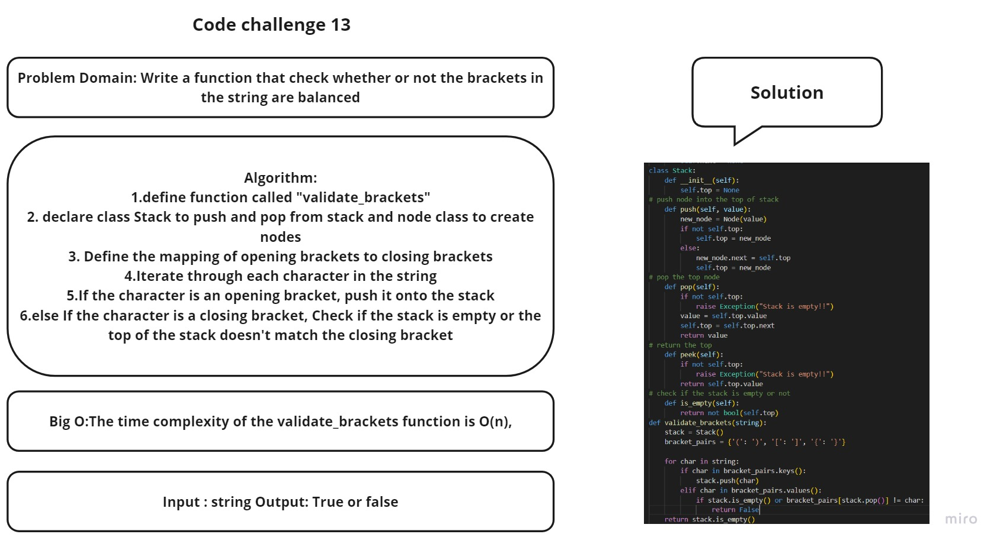

## White board



## Approach and effiency:
```
I declared a function called validate_brackets which check if all opening brackets have closing brackets

```
## Solution
```
def validate_brackets(string):
    stack = [] 

    brackets_map = {
        '(': ')',
        '[': ']',
        '{': '}'
    }

 
    for char in string:
       
        if char in brackets_map.keys():
            stack.append(char)
      
        elif char in brackets_map.values():
            
            if not stack or char != brackets_map[stack.pop()]:
                return False

    if stack:
        return False

    return True

```