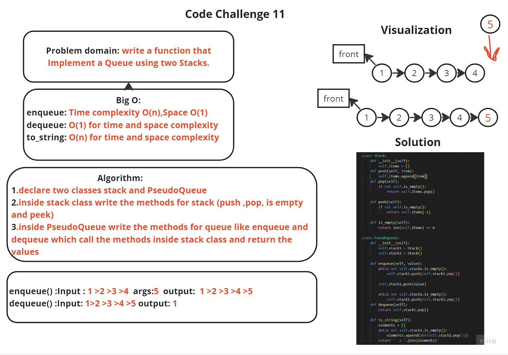

## White Board



## Approach and Effiency
```
Implement a Queue using two Stacks.
```
## Solution
```
class Stack:
    def __init__(self):
        self.items = []

    def push(self, item):
        self.items.append(item)

    def pop(self):
        if not self.is_empty():
            return self.items.pop()

    def peek(self):
        if not self.is_empty():
            return self.items[-1]

    def is_empty(self):
        return len(self.items) == 0

  

class PseudoQueue:
    def __init__(self):
        self.stack1 = Stack()
        self.stack2 = Stack()

    def enqueue(self, value):
        while not self.stack1.is_empty():
            self.stack2.push(self.stack1.pop())

        self.stack1.push(value)

        while not self.stack2.is_empty():
            self.stack1.push(self.stack2.pop())

    def dequeue(self):
        return self.stack1.pop()

    def to_string(self):
        elements = []
        while not self.stack1.is_empty():
            elements.append(str(self.stack1.pop()))

        return ' -> '.join(elements)
```