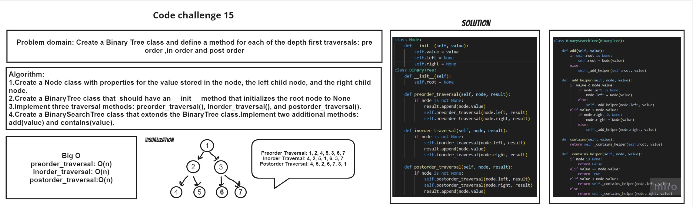

# white board:

# Approach and effiency
create Node class, Binary Tree class and Binary search class
# Solution
```
class Node:

    def __init__(self, value):
        self.value = value
        self.left = None
        self.right = None
class BinaryTree:

    def __init__(self):
        self.root = None

    def preorder_traversal(self, node, result):
        
         if node is not None:
            result.append(node.value)
            self.preorder_traversal(node.left, result)
            self.preorder_traversal(node.right, result)

    def inorder_traversal(self, node, result):
       
        if node is not None:
            self.inorder_traversal(node.left, result)
            result.append(node.value)
            self.inorder_traversal(node.right, result)

    def postorder_traversal(self, node, result):
        if node is not None:
            self.postorder_traversal(node.left, result)
            self.postorder_traversal(node.right, result)
            result.append(node.value)


class BinarySearchTree(BinaryTree):

    def add(self, value):
        if self.root is None:
            self.root = Node(value)
        else:
            self._add_helper(self.root, value)

    def _add_helper(self, node, value):
        if value < node.value:
            if node.left is None:
                node.left = Node(value)
            else:
                self._add_helper(node.left, value)
        elif value > node.value:
            if node.right is None:
                node.right = Node(value)
            else:
                self._add_helper(node.right, value)

    def contains(self, value):
        return self._contains_helper(self.root, value)

    def _contains_helper(self, node, value):
        if node is None:
            return False
        elif value == node.value:
            return True
        elif value < node.value:
            return self._contains_helper(node.left, value)
        else:
            return self._contains_helper(node.right, value)
```