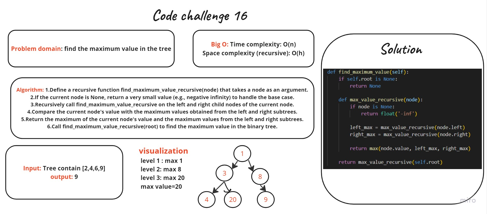

# White board

# Solution
```
def find_maximum_value(self):
        if self.root is None:
            return None
        
        def max_value_recursive(node):
            if node is None:
                return float('-inf')
            
            left_max = max_value_recursive(node.left)
            right_max = max_value_recursive(node.right)
            
            return max(node.value, left_max, right_max)
        
        return max_value_recursive(self.root)
 ```