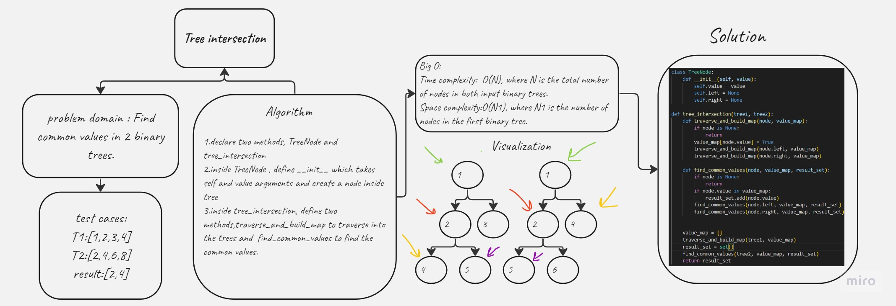

# Tree Intersection
[Code](./tree_intersection.py)
[Test](../tests/test_tree_intersection.py)
# White board:


# Approach and effiency:
create a method that find the common values between two binary trees

# Solution
```
class TreeNode:
    def __init__(self, value):
        self.value = value
        self.left = None
        self.right = None

def tree_intersection(tree1, tree2):
    def traverse_and_build_map(node, value_map):
        if node is None:
            return
        value_map[node.value] = True
        traverse_and_build_map(node.left, value_map)
        traverse_and_build_map(node.right, value_map)

    def find_common_values(node, value_map, result_set):
        if node is None:
            return
        if node.value in value_map:
            result_set.add(node.value)
        find_common_values(node.left, value_map, result_set)
        find_common_values(node.right, value_map, result_set)


    value_map = {}
    traverse_and_build_map(tree1, value_map)
    result_set = set()
    find_common_values(tree2, value_map, result_set)
    return result_set
```