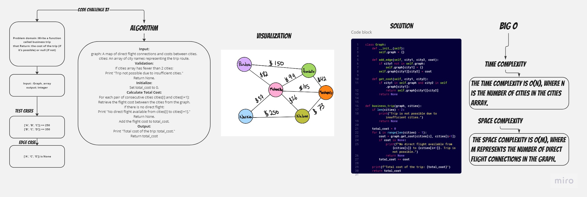

## challane:
Write a function that takes in a graph and an array of city names and Return: the cost of the trip (if it’s possible) or null (if not)
## White board:


## Approach & Efficiency
**The time complexity is O(n), where n is the number of cities in the cities array.**
**The space complexity is O(m), where m represents the number of direct flight connections in the graph**

## Solution:
```

def business_trip(graph, cities):
    if len(cities) < 2:
        print("Trip is not possible due to insufficient cities.")
        return None
    
    total_cost = 0
    for i in range(len(cities) - 1):
        cost = graph.get_cost(cities[i], cities[i+1])
        if cost is None:
            print(f"No direct flight available from {cities[i]} to {cities[i+1]}. Trip is not possible.")
            return None
        total_cost += cost
    
    print(f"Total cost of the trip: {total_cost}")
    return total_cost

```
